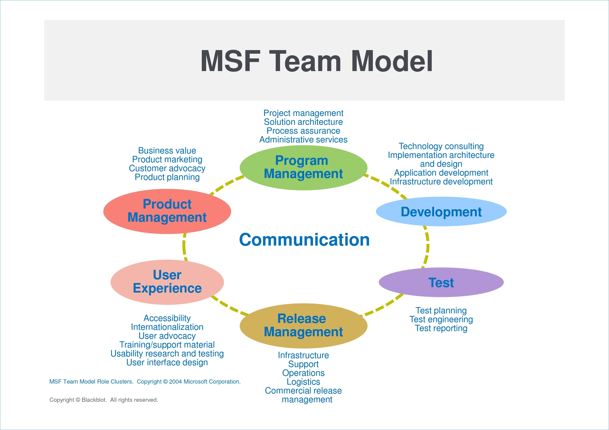

# KissNShare (KNS) Android Mobile NFT App
- Version 1 (Winter 2022) - 3 Sprints

Trusted Digital Web (TDW) Project, Hyperonomy Digital Identity Lab, Parallelspace Corporation

## Overview

This Vision and Scope document is a high-level description of the KissNShare (KNS) app to be developed using the Xamarin framework and intially targeting the Android mobile device (smart phone) platform. The high-level goals of the
initial version of the KissNShare app (version 1.0) include:
1. Enable a person to kiss their phone (like a "kiss on the lips"), 
2. During the kiss, measure and calculate as many orthogonal metrics as is practical (e.g. duration, presssure, coverage, location, use of the person's tongue, etc.), 
3. After the kiss, create a unique digital non-fungible token (BlueToqueTools NFT) describing the kiss,
4. Then serialize the NFT claims as a pair of nested (JSON) Structured Credentials, and
5. And finally, support the ability to share the KNS Structured Credential with virtually the same set of Android messaging apps
a smartphone user can use to share a photo.

Future versions of the KissNShare app may integrate with an web-based marketplace for buying, selling, and trading NFTs.

BlueToqueTools is a collection of software utilities, prototype apps, proof-of-concept (PoC) apps, and demonstration apps used
to support, validate, and/or demonstrate key features of
the Blue Toque family of Fully Decentralized Object (FDO) Framework specifications.

## Purpose
> High-level description of the purpose of a Vision and Scope document as well as the purpose of this project.

The purpose of this Vision and Scope document is to present the ideas and decisions developed during the Envisioning phase of a project. The goal of the phase, represented by the content of the documentation, is to achieve agreement on the desired solution and overall project direction. This documentat is usually written at the strategic level of detail and is used during the planning phase as the context for developing more detailed technical specifications and project management plans. It provides clear direction for the project team; outlines explicit, up-front discussion of project goals, priorities, and constraints; and sets project expectations  [MSF 3.0].

The purpose of the initial version of KissNShare app (version 1) is to:
1. Enable a person to kiss their phone (like a "kiss on the lips"), 
2. During the kiss, measure and calculate as many orthogonal metrics as is practical (e.g. duration, presssure, coverage, location, use of the person's tongue, etc.), 
3. After the kiss, create a unique digital non-fungible token (BlueToqueTools NFT) describing the kiss,
4. Then serialize the NFT claims as a pair of nested (JSON) Structured Credentials, and
5. And finally, support the ability to share the KNS Structured Credential with virtually the same set of Android messaging apps
a smartphone user can use to share a photo.

The higher level goals include:
- Demonstrating to both technical and non-technical people to understand the virtually any unique thing (e.g.
a piece of toast, a cow, a horse, a coyote pelt, an inscription chiseled on a pair of clay tablets (Ten Commandments), etc.) can be represented a digital NFT that can be bought, sold, and/or traded.

### Intended Audience
> Who is the intended audience for this document?

The primary audience for this Vision and Scope document is Implementors of BlueToqueTools-based NFT
apps, agents, and services on the Trusted Digital Web; including but not limited to: 
software architects, data modelers, application developers, services developers, testers, operators, 
and user experience (UX) specialists. 
In addition, other people involved in a broad range of standards efforts related to decentralized identity,
verifiable credentials, and secure storage may also be interested in reading this specification.

### Key Stakeholders
MSF Team Model Roles (see Appendix A)
- Program Management - Michael Herman
- Project Management - Michael Herman
- Development - Braeden Mitchell
- Test - Braeden Mitchell

## Related Resources
Specifications, whitepapers, presentations, webcasts/video streams, and other documents

- Strucutured Credentials Webcasts, TODO.
- Trusted Digitial Web Whitepaper, TODO.

### Market Research

#### 1. Kissing Test Calculator app

- Screenshots: [../research/Kissing Test Calculator app](../research/Kissing%20Test%20Calculator%20app)

#### 2. The Kissing Test app (trojan)

- Screenshots: [../research/The Kissing Test app (trojan)](../research/The%20Kissing%20Test%20app%20(trojan))

#### 3. Types of Kisses app

- Screenshots: [../research/Types of Kisses app](../research/Types%20of%20Kisses%20app)

## Definitions
Source: Trusted Digitial Web Whitepaper, TODO.

- DID Agent - TODO
- DID Agent Service Endpoint - TODO
- DID Agent Service Endpoint Cluster - Round-robin or load-balanced, failover-enabled cluster of DID Agents residing at
named service endpoints
- DID Document - TODO
- DID Identifier - TODO
- DID Object - TODO
- Marketplace - TODO
- Non-Fungible Token (NFT) - TODO
- Structured Credential - A superset of the the requirements for a Verifiable Credential. TODO
- Structured Credential Content - TODO
- Structured Credential Envelope - TODO
- Structured Credential Packing List - TODO
- Structured Credential Seal (Proof) -  TODO
- Verifiable Credential - TODO

## Problem Statement
> What problem is this project trying to solve? WHY this project is being undertaken.

TODO

## Project Drivers
> What are the key factors that drove the creation of this project?

TODO

## Goals and Objectives

TODO

## Vision Statement
> Where the project is headed and how it fits into a longer-term strategy. What is the overarching vision for this version (and future versions) of the project. The Vision Statement section clearly and concisely describes the future desired state of the project once it is complete. This can be a restatement of the problem statement, goals and objectives; however, it is written as if the future state has already been achieved. This statement provides a context for decision-making. It should be motivational to the project team and the customer. A shared Vision Statement among all team members helps ensure that the solution meets the intended goals. A solid vision builds trust and cohesion among team members, clarifies perspective, improves focus, and facilitates decision-making [MSF 3.0]. 

TODO

## Project Scope
> What the project's specific deliverables are and the general timeframe for their completion. The Solution Vision is intended to have a longer-term view, the Project Scope is expected to be more definite or concrete. The Scope places a boundary around the solution by detailing the range of features and functions, by defining what is out of scope, and by discussing the criteria by which the solution will be accepted by users and operations. The Scope clearly delineates what stakeholders expect the solution to do, thus making it a basis for defining project scope and for performing many types of project and operations planning [MSF 3.0].

TODO

### Out-of-Scope
> The Out of Scope section lists and defines a limited set of features and functions excluded from a product or solution —that is, the features and functions that fall outside its boundaries. It does not list everything that is Out of Scope; it only lists and defines features and functions that some users and other stakeholders might typically associate with a type of solution or product. Out of Scope documentation helps to clarify the solution scope and explicitly states what will not be delivered in the solution [MSF 3.0].

TODO

## Existing Environment (Marketplace)
> What is known about the environment (marketplace) where the solution is be used.

TODO

## User Requirements

TODO

### User Profiles (Personas)
> Initially, User Profiles enable the development of usage scenarios (next section). Beyond that, User Profiles provide the project teams with vital requirements information. A complete set of User Profiles ensures that all high-level requirements can be identified. The product team uses these profiles as input when developing the Feature/Function List. The development team uses these profiles as input to its architecture and technology design strategies. The user education team uses these profiles to establish the breadth of their work [MSF 3.0].

TODO

### User Scenario
> Usage Scenarios define the sequences of activities the users perform within the proposed solutions environment. This information is comprised of a set of key events that will occur within the users’ environment. These events should be described by their objectives, key activities and their sequences, and the expected results. Usage Scenarios provide vital information to identify and define the solution’s user and organizational requirements, the look and feel of user interfaces, and the performance users expect of the solution [MSF 3.0].

TODO

### Use Cases

TODO

### Business Objectives
> Business value expected to be received from the solution.

TODO

## Solution Vision
> Where the project is headed and how it fits into a longer-term strategy.

### System and Operational Objectives
> What are the system and operational objectives for the project.

TODO

### Support Objectives
> What are the user support and produce service objectives for the project.

TODO

## Solution Concept
> A Solutions Concept provides a general description of the technical approach the project team will take to meet the customer’s needs. This includes an understanding of the users and their needs, the solution’s features and functions, acceptance criteria, and the architectural and technical design approaches. The Solution Concept provides teams with limited but sufficient detail to prove the solution to be complete and correct; to perform several types of analyses including feasibility studies, risk analysis, usability studies, and performance analysis; and to communicate the proposed solution to the key stakeholders [MSF 3.0]

TODO

### Story Board

TODO

### External Integrations

TODO

## Critical Success Factors
> Critical success factors (CSFs) for this version of the project.  The CSFs should link to the business objectives but may be broader in scope.

TODO

## Key Dates

- Sprint #1 Complete - January 21, 2022
- Sprint #2 Complete - Feburary 28, 2022
- Sprint #3 Complete - March 31, 2022

- Internet Identity Workshop #34 - April 26, 27, & 28 2022, Mountain View, CA, http://iiw.idcommons.net. http://iiw34.eventbrite.com.

## Milestones

### Spring #1

- TODO

### Sprint #2

- TODO

### Sprint #3

- TODO

## Risk Management

- TODO

## Assumptions and Other Constraints

- TODO

## Appendix A - Microsoft Solutions Framework 3.0

### MSF Team Model

## Metadata

### Author
- Michael Herman, Founder, Trusted Digital Web
- Braeden Mitchell, Developer, Medicine Hat College

### Published
- January 2022

### Distribution
- Public

### Keywords
- Xamarian, Android, Kiss, App, NFT, Non-Fungible Token, Verifiable Credential, Structured Credential

### Intellectual Property Rights
- All trademarks are the property of their rightful owners
